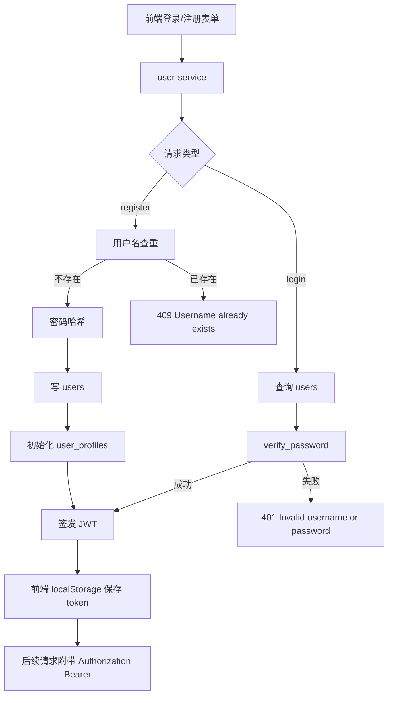
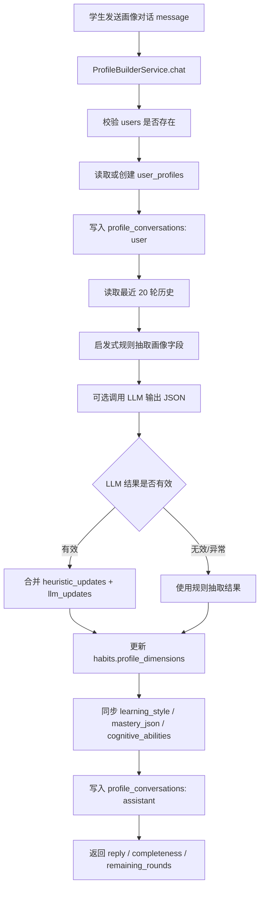
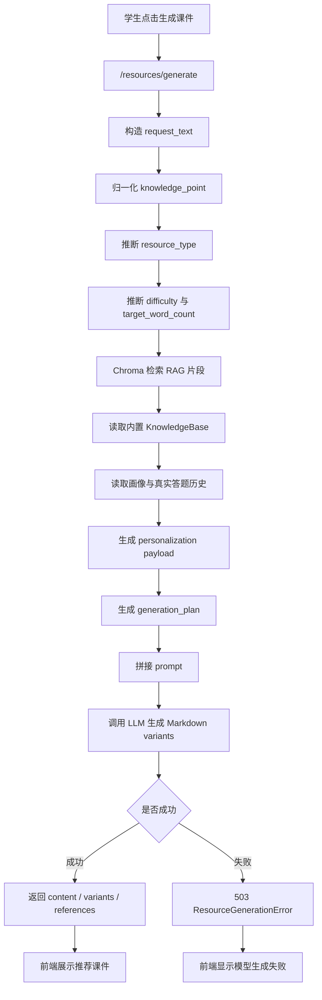
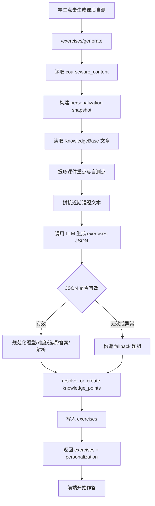
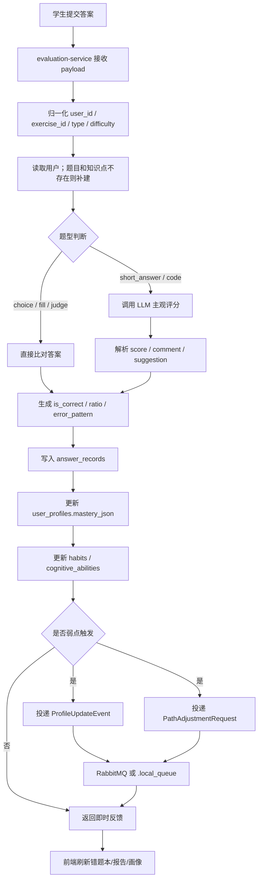
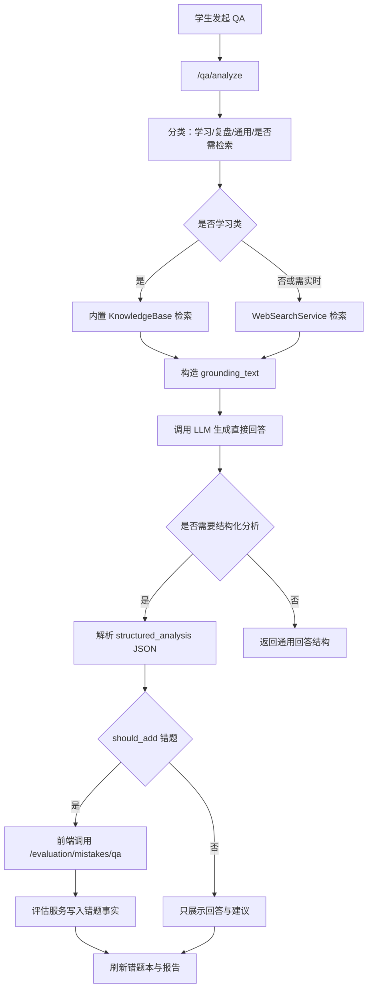

# 项目数据流程图说明

> 生成日期：2026-06-05  
> 依据范围：当前项目源码、`docs/openapi.yaml`、`docs/functionality.md`、`docs/evaluation-agent-flowchart.png`、`docs/evaluation-er-diagram.png`。  
> 说明：当前主联调链路以 Python FastAPI 微服务为准；`resource-service`、`system-service`、`teacher-service` 中部分管理数据仍为内存态演示实现。

## 1. 文字版数据流说明

### 1.1 总体链路

- 前端采用 Vue 3 + Element Plus，页面入口包括登录注册、学生工作台、教师工作台、管理端。
- 前端默认直接调用本地微服务端口：`user-service:8001`、`agent-service:8002`、`evaluation-service:8004`、`teacher-service:8005`、`system-service:8006`。
- Docker 场景中 `nginx` 可代理 `/api/users/*` 到 `user-service`，代理 `/api/agents/*` 到 `agent-service`。
- 主业务库通过 SQLAlchemy 模型承载，默认开发环境使用 `learning_system.db`，也可通过环境变量切换 PostgreSQL。
- 异步事件优先写入 RabbitMQ；若 `pika` 不可用，则降级写入 `.local_queue/*.jsonl`。
- Chroma 用于资源生成 RAG 检索；Neo4j 用于知识图谱查询；二者不可用时均存在确定性 fallback。

### 1.2 认证与用户画像链路

1. 登录/注册页提交 `username`、`password`、`role`、`email`。
2. `user-service` 对注册请求执行用户名查重、密码哈希、用户创建和空画像初始化。
3. 用户数据写入 `users`，画像数据写入 `user_profiles`。
4. 登录请求读取 `users`，校验密码后签发 JWT。
5. 前端把 JWT 写入 `localStorage.learning-system-auth`，后续请求通过 `Authorization: Bearer <token>` 传递。
6. 学生画像对话写入 `profile_conversations`，同时读取最近历史和 `user_profiles`。
7. `ProfileBuilderService` 先执行启发式抽取，再可选调用 LLM 输出 `profileUpdates` JSON。
8. 画像维度落到 `user_profiles.habits.profile_dimensions`，认知/节奏/弱项信息同步更新到 `learning_style`、`mastery_json`、`cognitive_abilities`。

### 1.3 学习路径与资源生成链路

1. 学生端提交学习目标、知识点、每日学习时长和学习画像。
2. `/paths/generate` 生成三阶段学习路径，归档旧 active 路径，并把新路径写入 `learning_paths.path_data_json`。
3. `/resources/generate` 接收 `user_id`、`knowledge_point`、`resource_style`、`resource_type`、`request_text`。
4. `ResourceGenerationService` 归一化知识点、推断资源类型、难度和目标字数。
5. 服务读取 Chroma 检索片段、内置知识库、用户画像、真实作答记录和最近错题，生成 `generation_plan`。
6. 服务调用 DeepSeek/Qwen/OpenAI 兼容模型生成 Markdown 课件和 variants。
7. 生成结果直接返回前端展示；当前该主生成链路不写入 `resources` 表。
8. 模型失败时返回 `503`，前端明确提示模型课件生成失败，不自动切换本地快速课件。

### 1.4 练习生成与评估闭环

1. 学生端基于当前课件内容调用 `/exercises/generate`。
2. `ExerciseGenerationService` 聚合画像、知识库、课件重点、近期错题，优先调用 LLM 生成结构化题组。
3. LLM 或 JSON 解析失败时，服务端生成 fallback 题组。
4. 题组持久化到 `knowledge_points` 与 `exercises`。
5. 学生提交答案到 `/evaluation/practice/submit` 或 `/evaluation/submit`。
6. `ReportService` 归一化用户、题目、题型、难度、耗时等字段。
7. 客观题直接比对标准答案；主观题和编程题调用 LLM 评分。
8. 评估结果写入 `answer_records.evaluation_json`。
9. `LearnerProfileUpdater` 基于作答结果更新 `user_profiles.mastery_json` 中的掌握度、连续错误次数、弱点标签和错误模式。
10. 若识别出薄弱知识点，系统异步投递 `ProfileUpdateEvent` 与 `PathAdjustmentRequest`。
11. 阶段报告、月度报告、综合报告从 `answer_records` 和 `user_profiles` 聚合生成，并写入 `learning_reports`。

### 1.5 智能问答、图谱、教师端与管理端链路

- `/qa/analyze` 对问题分类，学习类问题读取内置知识库，通用或实时类问题调用 web search，再由 LLM 生成自然语言回答和结构化学习分析。
- QA 自身默认不直接写错题；若返回的 `mistake_book_update.should_add=true`，前端再调用 `/evaluation/mistakes/qa` 写入评估链路。
- `/graph/dependencies`、`/graph/visualization`、`/graph/related-resources/{knowledge_point}` 优先访问 Neo4j，失败时返回 fallback 图谱数据。
- 教师端班级列表、班级进度、学生洞察当前为内存态；学生详情会并发聚合评估服务的错题本、阶段报告和综合报告。
- 管理端学科、配置、审计日志和角色分配当前为内存态演示；角色分配接口返回更新结果，但不实际修改 `users.role`。

## 2. Mermaid 完整流程图代码

```mermaid
flowchart TD
  classDef external fill:#fff4cc,stroke:#c79200,color:#2d2d2d;
  classDef frontend fill:#dbeafe,stroke:#2563eb,color:#102a43;
  classDef service fill:#e0f2fe,stroke:#0284c7,color:#082f49;
  classDef cache fill:#fef3c7,stroke:#d97706,color:#3b2500;
  classDef database fill:#dcfce7,stroke:#16a34a,color:#052e16;
  classDef queue fill:#fce7f3,stroke:#db2777,color:#500724;
  classDef error fill:#fee2e2,stroke:#dc2626,color:#450a0a;

  subgraph EXT["外部系统"]
    EXT_LLM["DeepSeek / Qwen / OpenAI<br/>OpenAI-compatible Chat Model"]
    EXT_WEB["WebSearchService<br/>通用/实时问题检索"]
  end

  subgraph FE["前端"]
    FE_PAGE["Vue Views<br/>Login / Register / Student / Teacher / Admin"]
    FE_AUTH["localStorage<br/>JWT / role / user_id"]
    FE_FALLBACK["前端 fallback<br/>路径/练习/QA/判分兜底"]
  end

  subgraph SVC["中间服务"]
    NGINX["Nginx<br/>可选 API 网关"]
    USER_API["user-service :8001<br/>/users/*"]
    AGENT_API["agent-service :8002<br/>/agents /paths /resources /exercises /qa /graph"]
    EVAL_API["evaluation-service :8004<br/>/evaluation/*"]
    RESOURCE_API["resource-service :8003<br/>/resources/* skeleton"]
    TEACHER_API["teacher-service :8005<br/>/teacher/*"]
    SYSTEM_API["system-service :8006<br/>/system/*"]
    AUTH_SVC["认证处理<br/>查重 / 哈希 / 校验 / JWT"]
    PROFILE_BUILDER["画像构建<br/>对话保存 / 规则抽取 / LLM 抽取"]
    PERSONALIZATION["个性化快照<br/>画像 + 答题历史 + 弱项题型"]
    COORDINATOR["CoordinatorWorkflow<br/>意图识别 -> 智能体选择 -> 队列投递"]
    RESOURCE_GEN["资源生成<br/>归一化 -> 计划 -> RAG -> LLM variants"]
    PATH_PLAN["学习路径规划<br/>三阶段路径 -> active 路径维护"]
    EXERCISE_GEN["练习生成<br/>LLM 出题 -> JSON 解析 -> fallback -> 持久化"]
    QA_SVC["智能答疑<br/>分类 -> 检索增强 -> LLM -> 结构化分析"]
    GRAPH_SVC["知识图谱查询<br/>依赖 / 推荐 / 可视化"]
    REPORT_SVC["评估与报告<br/>归一化 -> 评分 -> 反馈 -> 报告"]
    PROFILE_UPDATER["掌握度更新<br/>EMA 分数 / 弱点 / 错误模式"]
    TEACHER_AGG["教师聚合<br/>班级内存数据 + 评估报告"]
    SYSTEM_MGR["系统管理<br/>学科 / 配置 / 日志 / 角色内存态"]
  end

  subgraph CACHE["缓存与本地状态"]
    REDIS["Redis<br/>预留依赖"]
    CHROMA["Chroma<br/>education_resources 向量检索"]
    LOCAL_QUEUE[".local_queue/*.jsonl<br/>MQ 降级文件"]
  end

  subgraph DB["数据库与存储"]
    SQL_USERS["users<br/>账号/角色/邮箱/状态"]
    SQL_PROFILES["user_profiles<br/>mastery_json / learning_style / habits / cognitive_abilities"]
    SQL_PROFILE_CHAT["profile_conversations<br/>画像对话历史"]
    SQL_KP["knowledge_points<br/>知识点元数据"]
    SQL_KR["knowledge_relations<br/>知识点关系"]
    SQL_RES["resources<br/>资源表：模型存在，主生成链路当前未写入"]
    SQL_PATHS["learning_paths<br/>path_data_json / status"]
    SQL_TASKS["learning_tasks<br/>路径任务表：模型存在"]
    SQL_EXERCISES["exercises<br/>题干/答案/解析/难度"]
    SQL_ANSWERS["answer_records<br/>作答事实 / evaluation_json"]
    SQL_REPORTS["learning_reports<br/>阶段/月度/综合报告"]
    NEO4J["Neo4j<br/>KnowledgePoint 图谱"]
    MINIO["MinIO<br/>预留学习资产对象存储"]
    ES["Elasticsearch<br/>预留全文检索"]
  end

  subgraph MQ["消息队列"]
    RABBIT["RabbitMQ durable queues"]
    Q_PROFILE["profile_updates<br/>ProfileUpdateEvent"]
    Q_PATH["path_adjustments<br/>PathAdjustmentRequest"]
    Q_AGENT["agent task queues<br/>learner/resource/path/qa/evaluation agents"]
  end

  subgraph ERR["异常与降级"]
    ERR_401["401<br/>认证失败"]
    ERR_404["404<br/>用户/资源/路径不存在"]
    ERR_409["409<br/>用户名重复"]
    ERR_503["503<br/>模型/评估/生成服务失败"]
    ERR_FALLBACK["fallback<br/>本地题组/路径/图谱/演示数据"]
  end

  FE_PAGE -->|"同步 HTTP JSON"| USER_API
  FE_PAGE -->|"同步 HTTP JSON"| AGENT_API
  FE_PAGE -->|"同步 HTTP JSON"| EVAL_API
  FE_PAGE -->|"同步 HTTP JSON"| TEACHER_API
  FE_PAGE -->|"同步 HTTP JSON"| SYSTEM_API
  FE_PAGE -->|"可选代理"| NGINX
  NGINX --> USER_API
  NGINX --> AGENT_API

  USER_API --> AUTH_SVC
  AUTH_SVC -->|"register: 写用户"| SQL_USERS
  AUTH_SVC -->|"register: 初始化画像"| SQL_PROFILES
  AUTH_SVC -->|"login: 查用户"| SQL_USERS
  AUTH_SVC -->|"校验成功: JWT"| FE_AUTH
  AUTH_SVC -->|"用户名重复"| ERR_409
  AUTH_SVC -->|"密码错误"| ERR_401
  USER_API -->|"/users/me: Bearer Token"| SQL_USERS
  USER_API -->|"用户不存在"| ERR_404

  FE_PAGE -->|"/users/{id}/profile/chat: message"| PROFILE_BUILDER
  PROFILE_BUILDER -->|"写 user 消息"| SQL_PROFILE_CHAT
  PROFILE_BUILDER -->|"读取最近对话"| SQL_PROFILE_CHAT
  PROFILE_BUILDER -->|"读取/创建画像"| SQL_PROFILES
  PROFILE_BUILDER -->|"可选 LLM 抽取 profileUpdates"| EXT_LLM
  EXT_LLM -->|"reply + profileUpdates JSON"| PROFILE_BUILDER
  PROFILE_BUILDER -->|"更新画像维度"| SQL_PROFILES
  PROFILE_BUILDER -->|"写 assistant 消息"| SQL_PROFILE_CHAT
  PROFILE_BUILDER -->|"LLM 失败: 规则抽取"| ERR_FALLBACK

  FE_PAGE -->|"/agents/coordinate: intent/payload"| COORDINATOR
  COORDINATOR -->|"analyze_intent"| COORDINATOR
  COORDINATOR -.->|"异步 dispatch_tasks"| RABBIT
  RABBIT --> Q_AGENT
  COORDINATOR -.->|"pika 不可用"| LOCAL_QUEUE

  FE_PAGE -->|"/paths/generate: user_id/kp/daily_minutes/profile"| PATH_PLAN
  PATH_PLAN -->|"生成三阶段任务"| PATH_PLAN
  PATH_PLAN -->|"归档旧 active"| SQL_PATHS
  PATH_PLAN -->|"写入新 active path_data_json"| SQL_PATHS
  FE_PAGE -->|"/paths/adjust: complete/reset/skip"| PATH_PLAN
  PATH_PLAN -->|"更新 task status"| SQL_PATHS
  PATH_PLAN -->|"无路径或任务"| ERR_404

  FE_PAGE -->|"/resources/generate: kp/style/type/request_text"| RESOURCE_GEN
  RESOURCE_GEN -->|"归一化知识点/类型/难度/字数"| RESOURCE_GEN
  RESOURCE_GEN -->|"RAG retrieve"| CHROMA
  CHROMA -->|"snippet 或 fallback snippet"| RESOURCE_GEN
  RESOURCE_GEN -->|"build_snapshot"| PERSONALIZATION
  PERSONALIZATION --> SQL_PROFILES
  PERSONALIZATION --> SQL_ANSWERS
  PERSONALIZATION --> SQL_EXERCISES
  RESOURCE_GEN -->|"prompt: plan + RAG + 画像 + 错题"| EXT_LLM
  EXT_LLM -->|"Markdown content + variants"| RESOURCE_GEN
  RESOURCE_GEN -->|"返回课件，不写 resources"| FE_PAGE
  RESOURCE_GEN -->|"模型失败"| ERR_503

  FE_PAGE -->|"/exercises/generate: kp/mode/count/courseware"| EXERCISE_GEN
  EXERCISE_GEN --> PERSONALIZATION
  EXERCISE_GEN -->|"知识库/课件重点/近期错题"| EXERCISE_GEN
  EXERCISE_GEN -->|"LLM JSON 题组"| EXT_LLM
  EXT_LLM -->|"exercises JSON"| EXERCISE_GEN
  EXERCISE_GEN -->|"LLM 或解析失败"| ERR_FALLBACK
  EXERCISE_GEN -->|"resolve_or_create"| SQL_KP
  EXERCISE_GEN -->|"写入题目"| SQL_EXERCISES
  EXERCISE_GEN -->|"返回题组"| FE_PAGE

  FE_PAGE -->|"/evaluation/practice/submit: answer payload"| REPORT_SVC
  REPORT_SVC -->|"归一化 user/exercise/type/difficulty/time"| REPORT_SVC
  REPORT_SVC -->|"读取用户"| SQL_USERS
  REPORT_SVC -->|"upsert 题目"| SQL_EXERCISES
  REPORT_SVC -->|"upsert 知识点"| SQL_KP
  REPORT_SVC -->|"客观题直接比对"| REPORT_SVC
  REPORT_SVC -->|"主观/编程题 LLM 评分"| EXT_LLM
  EXT_LLM -->|"score/comment/suggestion"| REPORT_SVC
  REPORT_SVC -->|"写 evaluation_json"| SQL_ANSWERS
  REPORT_SVC --> PROFILE_UPDATER
  PROFILE_UPDATER -->|"更新掌握度/弱点/错误模式"| SQL_PROFILES
  REPORT_SVC -.->|"ProfileUpdateEvent"| RABBIT
  REPORT_SVC -.->|"PathAdjustmentRequest"| RABBIT
  RABBIT --> Q_PROFILE
  RABBIT --> Q_PATH
  REPORT_SVC -.->|"RabbitMQ 不可用"| LOCAL_QUEUE
  REPORT_SVC -->|"返回即时反馈"| FE_PAGE

  FE_PAGE -->|"/evaluation/mistakes/* /reports/* /suggestions/*"| REPORT_SVC
  REPORT_SVC -->|"聚合作答轨迹"| SQL_ANSWERS
  REPORT_SVC -->|"读取画像"| SQL_PROFILES
  REPORT_SVC -->|"读取题目/知识点"| SQL_EXERCISES
  REPORT_SVC --> SQL_KP
  REPORT_SVC -->|"阶段/月度报告可调用 LLM"| EXT_LLM
  REPORT_SVC -->|"保存报告"| SQL_REPORTS
  REPORT_SVC -->|"无真实记录"| ERR_FALLBACK

  FE_PAGE -->|"/qa/analyze: question/context/history"| QA_SVC
  QA_SVC -->|"分类: 学习/复盘/通用"| QA_SVC
  QA_SVC -->|"学习类知识片段"| QA_SVC
  QA_SVC -->|"通用/实时检索"| EXT_WEB
  EXT_WEB -->|"web snippets"| QA_SVC
  QA_SVC -->|"grounding prompt"| EXT_LLM
  EXT_LLM -->|"student_response + structured_analysis"| QA_SVC
  QA_SVC -->|"LLM 失败"| ERR_FALLBACK
  QA_SVC -->|"返回回答与结构化分析"| FE_PAGE
  FE_PAGE -->|"should_add=true: /evaluation/mistakes/qa"| REPORT_SVC

  FE_PAGE -->|"/graph/dependencies /visualization /related-resources"| GRAPH_SVC
  GRAPH_SVC -->|"Cypher 查询"| NEO4J
  NEO4J -->|"nodes/edges/resources"| GRAPH_SVC
  GRAPH_SVC -->|"Neo4j 不可用"| ERR_FALLBACK
  GRAPH_SVC -->|"返回图谱数据"| FE_PAGE

  FE_PAGE -->|"/teacher/classes /progress /insights"| TEACHER_AGG
  TEACHER_AGG -->|"内存班级/洞察"| TEACHER_AGG
  FE_PAGE -->|"/teacher/classes/{class}/students/{user}"| TEACHER_AGG
  TEACHER_AGG -->|"并发拉取报告/错题"| EVAL_API
  EVAL_API --> REPORT_SVC
  TEACHER_AGG -->|"评估不可用"| ERR_FALLBACK

  FE_PAGE -->|"/system/subjects /configs /logs /roles/assign"| SYSTEM_MGR
  SYSTEM_MGR -->|"内存 subjects/configs/logs"| SYSTEM_MGR

  FE_PAGE -->|"/resources list/detail/export/status"| RESOURCE_API
  RESOURCE_API -->|"内存 ResourceManager"| RESOURCE_API
  RESOURCE_API -->|"未找到 resource_id"| ERR_404
  RESOURCE_API -.->|"预留对象存储"| MINIO
  RESOURCE_API -.->|"预留资源表"| SQL_RES

  SQL_USERS -->|"1:1"| SQL_PROFILES
  SQL_USERS -->|"1:N"| SQL_PROFILE_CHAT
  SQL_USERS -->|"1:N"| SQL_PATHS
  SQL_USERS -->|"1:N"| SQL_ANSWERS
  SQL_USERS -->|"1:N"| SQL_REPORTS
  SQL_PATHS -->|"1:N，模型预留"| SQL_TASKS
  SQL_KP -->|"1:N"| SQL_EXERCISES
  SQL_KP -->|"1:N / N:N 语义"| SQL_KR
  SQL_EXERCISES -->|"1:N 作答"| SQL_ANSWERS
  SQL_KP -->|"1:N"| SQL_RES
  SQL_USERS -->|"1:N generated_for_user"| SQL_RES

  class EXT_LLM,EXT_WEB external;
  class FE_PAGE,FE_AUTH,FE_FALLBACK frontend;
  class NGINX,USER_API,AGENT_API,EVAL_API,RESOURCE_API,TEACHER_API,SYSTEM_API,AUTH_SVC,PROFILE_BUILDER,PERSONALIZATION,COORDINATOR,RESOURCE_GEN,PATH_PLAN,EXERCISE_GEN,QA_SVC,GRAPH_SVC,REPORT_SVC,PROFILE_UPDATER,TEACHER_AGG,SYSTEM_MGR service;
  class REDIS,CHROMA,LOCAL_QUEUE cache;
  class SQL_USERS,SQL_PROFILES,SQL_PROFILE_CHAT,SQL_KP,SQL_KR,SQL_RES,SQL_PATHS,SQL_TASKS,SQL_EXERCISES,SQL_ANSWERS,SQL_REPORTS,NEO4J,MINIO,ES database;
  class RABBIT,Q_PROFILE,Q_PATH,Q_AGENT queue;
  class ERR_401,ERR_404,ERR_409,ERR_503,ERR_FALLBACK error;
```

## 3. 核心接口链路矩阵

| 入口 | 入参来源 | 加工逻辑 | 落地位置 | 异常分支 |
| --- | --- | --- | --- | --- |
| `POST /users/register` | 注册页表单 | 查重、密码哈希、创建用户、初始化画像、签发 JWT | `users`、`user_profiles` | `409` 用户名重复 |
| `POST /users/login` | 登录页表单 | 查询用户、密码校验、签发 JWT | 读取 `users` | `401` 认证失败 |
| `GET /users/me` | JWT 请求头 | 解析 Bearer token，读取当前用户 | 读取 `users` | `401` 或 `404` |
| `GET /users/{id}/profile` | 学生 ID | 查询画像并展开 `profile_dimensions` | 读取 `user_profiles` | `404` 画像不存在 |
| `POST /users/{id}/profile/chat` | 学生画像对话 | 保存对话、规则抽取、可选 LLM 抽取、更新画像 | `profile_conversations`、`user_profiles` | LLM 失败走规则 fallback |
| `PUT /users/{id}/profile` | 手动画像表单 | 校验用户，合并画像维度 | `user_profiles` | `404` 用户不存在 |
| `POST /agents/coordinate` | 学习目标/意图 | 意图识别、选择智能体、投递任务队列 | `RabbitMQ` 或 `.local_queue` | MQ 不可用写本地 JSONL |
| `POST /paths/generate` | 学习目标/知识点/画像 | 生成三阶段路径，归档旧 active 路径 | `learning_paths` | 服务失败前端本地路径 |
| `GET /paths/{user_id}` | 学生 ID | 查询最新 active 路径 | `learning_paths` | `404` 路径不存在 |
| `POST /paths/adjust` | 任务 ID 与动作 | 更新任务 `pending/completed/skipped` | `learning_paths.path_data_json` | `404` 任务不存在 |
| `POST /resources/generate` | 知识点/资源风格/学习目标 | RAG 检索、画像聚合、生成计划、LLM 课件生成 | 当前返回前端，不写 `resources` | LLM 失败返回 `503` |
| `POST /exercises/generate` | 课件内容/知识点/画像 | 画像聚合、错题参考、LLM 出题、失败本地生成 | `knowledge_points`、`exercises` | LLM 失败仍返回 fallback 题组 |
| `POST /evaluation/practice/submit` | 学生作答 | 归一化、评分、反馈、画像更新、事件投递 | `answer_records`、`user_profiles` | 评估失败前端本地判分 |
| `POST /evaluation/mistakes/qa` | QA 结构化错题 | 复用评估链路写错题事实 | `answer_records`、`user_profiles` | `400/404/503` |
| `GET /evaluation/mistakes/{id}/detail` | 学生 ID | 从真实作答中筛选错题 | 读取 `answer_records` | 无记录返回空列表 |
| `GET /evaluation/reports/*` | 学生 ID | 聚合作答记录和画像，生成报告 | `learning_reports` | 无记录返回空报告/提示练习 |
| `POST /qa/analyze` | 学生问题/错题上下文 | 分类、检索、LLM 回答、结构化分析 | 默认不直接落库 | 若需入错题，前端再调评估服务 |
| `POST /graph/visualization` | 知识点/深度 | Neo4j 查询依赖/推荐节点 | Neo4j | Neo4j 失败返回确定性 fallback |
| `GET /teacher/classes/{id}/students/{uid}` | 教师端学生详情 | 并发聚合报告、错题、综合分析 | 读取评估服务 | 评估服务失败返回演示 fallback |
| `/system/*` | 管理端表单 | 学科/配置/日志/角色演示管理 | 当前内存态 | 重启丢失 |

## 4. 拆分子流程图

### 4.1 认证与画像构建

### 4.2 资源生成与练习生成

### 4.3 答题评估闭环

### 4.4 智能问答与错题同步

## 5. 节点释义清单

| 节点类型 | 代表节点 | 职责 |
| --- | --- | --- |
| 外部系统 | `DeepSeek/Qwen/OpenAI`、`WebSearchService` | LLM 生成、评分、画像抽取、通用问题检索 |
| 前端 | `Vue Views`、`localStorage` | 收集入参、展示结果、保存 JWT、处理前端 fallback |
| 中间服务 | `user-service` | 用户注册、登录、JWT、画像读取和画像对话入口 |
| 中间服务 | `agent-service` | 智能体协调、学习路径、课件生成、练习生成、QA、图谱查询 |
| 中间服务 | `evaluation-service` | 作答评估、错题本、画像掌握度更新、报告生成、异步事件投递 |
| 中间服务 | `teacher-service` | 教师端班级、洞察和学生详情聚合 |
| 中间服务 | `system-service` | 管理端学科、配置、日志、角色分配演示能力 |
| 中间服务 | `resource-service` | 资源管理 skeleton，当前使用内存 `ResourceManager` |
| 缓存/本地状态 | `Redis` | 当前主要为服务依赖预留 |
| 缓存/本地状态 | `Chroma` | 资源生成 RAG 向量检索 |
| 缓存/本地状态 | `.local_queue` | RabbitMQ 或 `pika` 不可用时的本地队列降级 |
| 数据库 | `users` | 账号、密码哈希、角色、邮箱、启用状态 |
| 数据库 | `user_profiles` | 掌握度、学习风格、认知能力、习惯、画像维度 |
| 数据库 | `profile_conversations` | 画像构建对话历史 |
| 数据库 | `knowledge_points` | 知识点元数据 |
| 数据库 | `knowledge_relations` | 知识点关系表 |
| 数据库 | `learning_paths` | 个性化路径 JSON 和状态 |
| 数据库 | `learning_tasks` | 路径任务模型，当前主要预留 |
| 数据库 | `exercises` | 题干、答案、解析、难度 |
| 数据库 | `answer_records` | 学生作答事实和评估结果 |
| 数据库 | `learning_reports` | 阶段、月度、综合报告 |
| 数据库/图存储 | `Neo4j` | 知识图谱依赖、推荐和资源关联 |
| 数据库/对象存储 | `MinIO` | 学习资产对象存储预留 |
| 数据库/检索 | `Elasticsearch` | 全文检索预留 |
| 消息队列 | `RabbitMQ` | 智能体任务、画像更新、路径调整请求 |
| 异常分支 | `401/404/409/503` | 登录失败、资源不存在、用户名重复、模型或服务失败 |
| 降级分支 | `fallback` | 本地题组、本地路径、确定性图谱、演示教师数据 |
